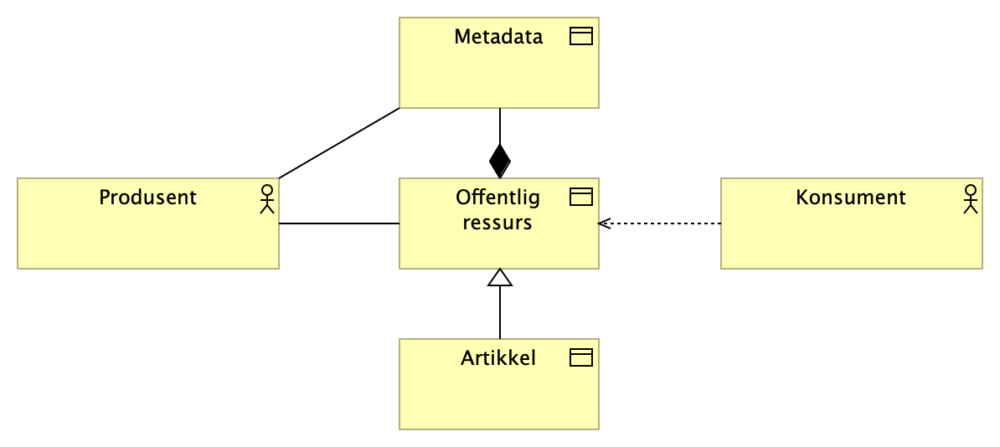
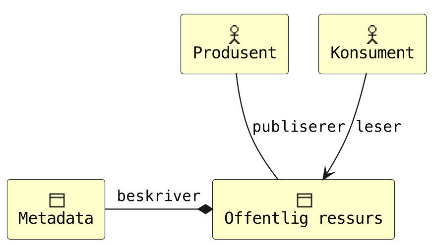
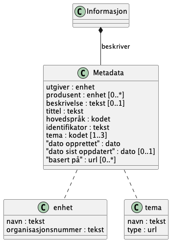
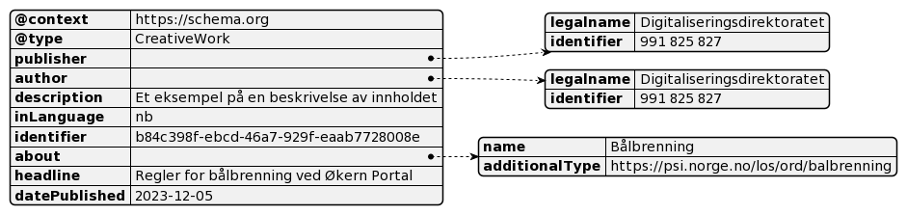

# Veileder for utveksling av metadata om offentlige ressurser på nett

<span style="color:red">**UNDER UTVIKLING - PÅGÅENDE ARBEID**</span>

Digitaliseringsdirektoratet, [xx.12.2023]

Formål med dette notatet er at det kan utvikles til en fullverdig veileder. Målet er at innholdet beskriver et minimumssett av metadata som kan implementeres som et enkleste brukbare produkt (_MVP_[^1] ) og utprøves ved hjelp av smidig metode.

# Behov

## Bakgrunn

Veilederen er utviklet som en del av _Helhetlig informasjon for digital assistanse_ (HIDA) hos Digitaliseringsdirektoratet.

[Litt mer tekst om behovet for bedret samhandling/helhetlig informasjon, utredning/analyse, om det passer]

[Evt overordnede førende krav, som Los, EU/Europa]

## Anvendelse

>_Som produsent av offentlig informasjon,_
>
>_ønsker jeg at innhold publisert på internett er tilstrekkelig merket med metadata,_
>
>_slik at innholdet bedre kan tolkes av konsumenter._

## Begrep brukt i veilederen

**Produsent** er her en offentlig etat som produserer og publiserer offentlig ressurser (innhold, informasjon) beregnet på innbyggere og næringsliv. Innhold publiseres typisk ved hjelp av et publiseringssystem[^2].

**Konsument** er her programvare brukt av andre offentlige etater, innbyggere og næringsliv, slik som programvare-roboter (digitale assistenter, indekseringstjenester/søkemotorer, kunstig intelligens) og systemer for videre publisering.

**Metadata** - Data om data, informasjon som beskriver annen informasjon, gjerne en elektronisk fil som et tekstdokument, bilde eller film.[^3]

**Offentlige ressurser på nett** - ressurser som offentlige virksomheter forvalter som er adresserte med HTTP eller HTTPS-protokollen[^4]. Eksempelvis artikler og informasjon til innbyggere og næringsliv.

# Juridisk samhandlingsevne

Det er ingen juridiske føringer for anvendelsen. Det kan vurderes å gjøre normere hele eller deler av denne veilederen ved å gjøre den til en anbefalt eller obligatorisk standard i Referansekatalogen for IT-standarder[^5].

[Eventuelle eksisterende krav i Referansekatalogen som vil være aktuelle]

# Organisatorisk samhandlingsevne

[Overordnet beskrivelse forretningsprosess]

[Aktører]

**Produsent** – Se definisjon over.

**Konsument** – Se definisjon over.

<!--  -->



_Figur 1 Archimate-diagram for organisatorisk samhandlingsevne [To utgaver, UML use case-diagram kan vurderes, samt UML sekvensdiagram]_

# Semantisk samhandlingsevne

Under følger beskrivelse av felles informasjonsmodell, kodeverk/terminologi og syntaks/format for utveksling av metadata.

## Informasjonsmodell



_Figur 2 UML klassediagram for metadata_

| **Metadata-felt** | **Type** | **Krav** | **Beskrivelse** |
| --- | --- | --- | --- |
| **Utgiver** | enhet | Obligatorisk | Organisasjonen som publiserer teksten på eget nettsted |
| **Produsent** | enhet | Frivillig, flere er mulig | Organisasjonen som forfatter teksten |
| **Beskrivelse** | tekst | Frivillig | Kort beskrivelse av tekstens innhold og kontekst |
| **Hovedspråk** | kodet | Obligatorisk | Språket størstedelen av teksten er på, se _Kodeverk/terminologi_ |
| **Identifikator** | tekst | Obligatorisk | Unik identifikator basert på UUID[^6] |
| **Tema** | kodet | Obligatorisk, flere er mulig | Tekstens hovedtema basert på Los, se Kodeverk/terminologi. |
| **Tittel** | tekst | Obligatorisk | Artikkelens tittel |
| **Dato opprettet** | dato | Frivillig | Dato for publisering |
| **Dato sist oppdatert** | dato | Frivillig | Dato for oppdatering |
| **Basert på** | URL | Frivillig, flere er mulig | Peker til original(er) hvis dette er et derivat, for eksempel ved automatisk sammenstilling med kunstig intelligens. |

## Kodeverk/terminologi

### Tema

Los benyttes for kor koding av attributtet _tema_.

Los er et felles vokabular som er temainndelt for å kategorisere og beskrive offentlige tjenester og ressurser[^7]. Los brukes her primært for å kategorisere og beskrive offentlige sluttbrukertjenester og ressurser, samt å optimalisere søk på nettsider.

Det kodes på tre nivåer:

1. Det skal som minimum kodes med **hovedtema**
2. Det er sterkt anbefalt og også kode med **undertema**
3. Det er anbefalt å kode med **emneord**

Se dokumentasjon for Los på data.norge.no: [Los (norge.no)](https://data.norge.no/docs/los-dokumentasjon)

### Hovedspråk

- [ ] TODO -\> nb|nn|en etc. som streng, ikke BCP-47[^8].

## Syntaks/format

Det anbefales å uttrykke metadata på ett eller flere format som kan benyttes med CMS. Det finnes ingen dominerende standard. Mye brukte formater er JSON Linked Data (JSON-LD), RDFa og [Micodata]. Felles for disse er at de benytter vokabular beskrevet på Schema.org, et dugnadsdrevet arbeid med mål om å lage og forvalte [skjemaer] for strukturerte data på internett.

### Kobling til schema.org

Attributtene er hovedsaklig hentet fra _CreativeWork_[^9].

| **Metadata-felt** | **Schema.org** | **Datatype** |
| --- | --- | --- |
| **Utgiver** | publisher | Organization (legalName, identifier) |
| **Produsent** | author | Organization (legalName, identifier) |
| **Beskrivelse** | description | Text |
| **Hovedspråk** | inLanguage | Text [eller Language] |
| **Identifikator** | identifier | Text |
| **Tema** | about | Thing (name, additionalType) |
| **Tittel** | headline | Text |
| **Dato opprettet** | datePublished | Date / DateTime |
| **Dato sist oppdatert** | dateModified | Date / DateTime |
| **Basert på** | isBasedOn | URL |

Eksempel på bruk finnes i Appendiks 1 – Eksempel på JSON-LD.

# Teknisk samhandlingsevne

En _produsent_ må ha et publiseringssystem som støtter én eller flere format. Denne veilederen presiserer støtte for JSON-LD bygd opp med vokabular fra Schema.org på artikkelnivå (side) som minimumskrav. Ytterligere formater f.eks. RDFa på artikkel- og blokknivå kan prøves ut.

Innholdet skal publiseres på internett fritt tilgjengelig og uten hinder.

En _konsument_ må ha programvare som kan lese og behandle informasjon, inkludert metadata, fra produsentenes publiseringssystem. Det er et minimumskrav å kunne lese og behandle JSON-LD bygd opp med vokabular fra Schema.org.

# Oppfølging

[Anbefaling om videre oppfølging av veilederen for å ferdigstille den hvis det er mangler (les: Los), anbefaling om prosess for utprøving (les: ETI, +), normering/forvaltning (f.eks. publisering via GitHub]

---

# Appendiks A – Eksempler

## JSON-LD



_Figur 3 Et lesbart eksempel på metadata som JSON-LD_

```json
<script type="application/ld+json"\>
{
    "@context": "https://schema.org",
    "@type": "CreativeWork",
    "publisher": {
        "legalname" : "Digitaliseringsdirektoratet",
        "identifier" : "991 825 827"
    },
    "author": {
        "legalname" : "Digitaliseringsdirektoratet",
        "identifier" : "991 825 827"
    },
    "description" : "Et eksempel på en beskrivelse av innholdet",
    "inLanguage" : "nb",
    "identifier" : "b84c398f-ebcd-46a7-929f-eaab7728008e ",
    "about" : {
        "name" : "Bålbrenning",
        "additionalType" : "https://psi.norge.no/los/ord/balbrenning"
     },
    "headline" : "Regler for bålbrenning ved Økern Portal",
    "datePublished" : "2023-12-05"
}
</script\>
```

# Appendix B - Verktøy

- [PlantUML](https://plantuml.com/)
- [PlantText Editor](https://www.planttext.com/)
- [Archi](https://www.archimatetool.com/) - archimate modelling

[^1]: Minimum viable product, et så enkelt produkt som mulig, men som faktisk gir verdi for brukerne og nyttig tilbakemelding til videreutvikling

[^2]: Engelsk: Content management system (CMS)

[^3]: [metadata - Felles begrepskatalog](https://www.termportalen.no/FBK/bkg/20b2e2a5-9fe1-11e5-a9f8-e4115b280940)

[^4]: [Peikarar til offentlege ressursar på nett | Digdir](https://www.digdir.no/standarder/peikarar-til-offentlege-ressursar-pa-nett/1492)

[^5]: [Referansekatalogen for IT-standardar | Digdir](https://www.digdir.no/standarder/referansekatalogen-it-standardar/1480)

[^6]: [RFC 4122 - A Universally Unique IDentifier (UUID) URN Namespace (ietf.org)](https://datatracker.ietf.org/doc/html/rfc4122)

[^7]: [Los - felles vokabular for klassifisering av offentlige tjenester og ressurser | Digdir](https://www.digdir.no/informasjonsforvaltning/los-felles-vokabular-klassifisering-av-offentlige-tjenester-og-ressurser/2434)

[^8]: [Information on BCP 47 » RFC Editor (rfc-editor.org)](https://www.rfc-editor.org/info/bcp47)

[^9]: [CreativeWork - Schema.org Type](https://schema.org/CreativeWork)