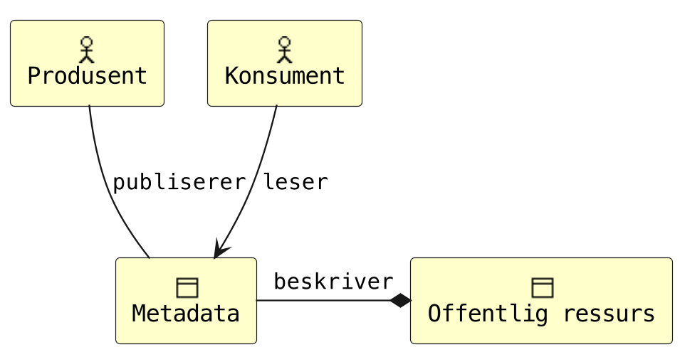
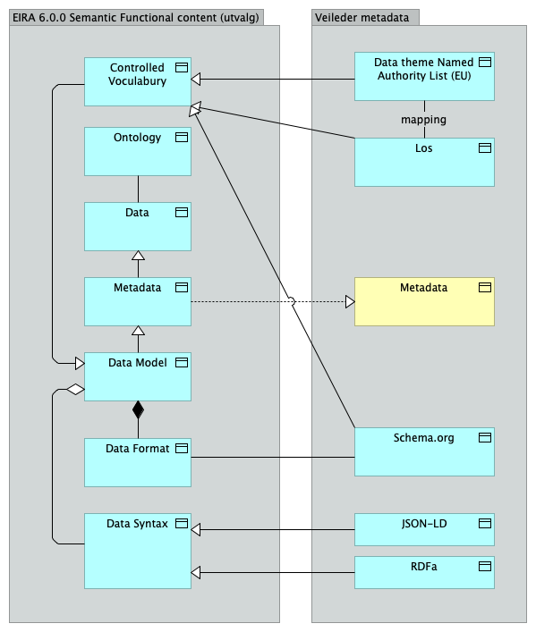
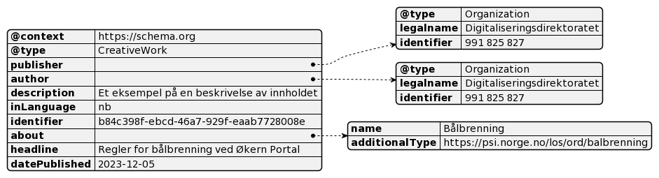

# Utveksling av metadata om offentlige ressurser på nett

NB! **UNDER UTVIKLING - PÅGÅENDE ARBEID**

HIDA-teamet, Digitaliseringsdirektoratet, [xx.12.2023]

Denne siden forvaltes på GitHub: [https://github.com/rockphotog/hida](https://github.com/rockphotog/hida)

## Gjøremålsliste (midlertidig)  

Bruk gjerne [issues](https://github.com/rockphotog/hida/issues) for å spille inn forslag/endringer/feil.  

### Felles diskusjon

- [ ] Kun mulig med én "about" - løsning? Nederste? Krever strengt hierarki - er ikke det nå, lite brukervennlig
- [ ] Forslag/diskusjon: dekningsområde -> Thing/Intangible/Service/areaServed(/eligibleRegion), mulig kobles på under "about" - bedre støtte under f.eks "Product", "Service"
- [ ] Skal de kunne kodes med f.eks. flere koder på nivå 2 (undertema) og 3 (emneord)?
- [ ] Kan "Produsent" hete "Forfatter"? Mener kanskje likevel "Produsent" er videre, men en fordel
- [ ] "Name"(text) mulig for "tema/about" - "kjekt å ha" eller "smør på flesk"? Skal leses av maskiner, ikke folk. Fordel: Lesbarhet. Ulempe: Presedens ved feil  
- [ ] date og/eller dateTime på hhv datePublished/dateModifies. Tror det er frivillig, foreslås 'både og'  
- [ ] isBasedOn (Espens forslag) - begrense til URL? Hvis ikke må strukturen utvides (CreativeWork / Product)
- [ ] Skrive noe om avgrensning på artikkel-nivå (vs blokker) grunnet MVP...?
- [ ] Krav-tabell: Bruke kardinaliteter (1..*, 1..1 etc) i stedet for tekst?
- [ ] [Finne eller lage regel for hva som kvalifiserer for å være "(sist) oppdatert"](https://github.com/rockphotog/hida/issues/1)

### Annet

- [ ] Husk språkkoder - endelig forslag til bruk  
- [ ] Følge opp mapping EY/Los-mapping: [https://github.com/Informasjonsforvaltning/behov/issues/444](https://github.com/Informasjonsforvaltning/behov/issues/444)
- [ ] Finne og referere til minimumskravene JY nevnte
- [ ] Gjøre om fotnoter til direkte lenker der det er naturlig
- [ ] Microdata - sjekk opp bruk
- [ ] Skrive videre på "Oppfølging", inkl forvaltning/forking av repo, etc.
- [ ] Ett eksempel til med JSON-LD med flere nivåer
- [ ] Eksempel RDFa? Inline/blokker?
- [ ] Rydde i eller fjerne Archi-filen
- [ ] Vurdere å henvise til praksis fra f.eks. Google/Microsoft

---

## Mål

Formål med dette arbeidet er at det kan utvikles til en veileder som normeres av Digitaliseringsdirektoratet.  

Målet er at innholdet beskriver et minimumssett av metadata som kan implementeres som et enkleste brukbare produkt (*MVP*[^1] ) og utprøves ved hjelp av smidig metode.  

Metadatasettet skal testes ut i livshendelsen [Alvorlig sykt barn](https://alvorligsyktbarn.no/) i prosjektet [Enklere tilgang til informasjon](https://alvorligsyktbarn.no/enklere-tilgang-til-informasjon) (ETI) i 2024.  

## Behov

### Bakgrunn

Veilederen er utviklet som en del av *Helhetlig informasjon for digital assistanse* (HIDA) hos Digitaliseringsdirektoratet.

Målet er å skape et helheltlig og brukervennlig informasjonstilbud for ulike brukergrupper og på tvers av offentlige tjenester. Det er i dag spesielt tidkrevende og komplekt for brukerne å finne relevant informasjon. En av grunnene er fraværet av felles regler og retningslinjer. Denne veilederen skal bidra til å bøte på det siste.

Les mer på Digitaliseringsbloggen: [Frå silo til samanheng](https://www.digdir.no/sammenhengende-tjenester/fra-silo-til-samanheng/5240).

### Anvendelse

>*Som produsent av offentlig informasjon,*
>
>*ønsker jeg at innhold publisert på internett er tilstrekkelig merket med metadata,*
>
>*slik at innholdet bedre kan tolkes av konsumenter.*

### Begrep brukt i veilederen

**Produsent** er her en offentlig etat som produserer og publiserer offentlig ressurser (innhold, informasjon) beregnet på innbyggere og næringsliv. Innhold publiseres typisk ved hjelp av et publiseringssystem[^2].

**Konsument** er her programvare brukt av andre offentlige etater, innbyggere og næringsliv, slik som programvare-roboter (digitale assistenter, indekseringstjenester/søkemotorer, kunstig intelligens) og systemer for videre publisering.

**Metadata** - Data om data, informasjon som beskriver annen informasjon, gjerne en elektronisk fil som et tekstdokument, bilde eller film.[^3]

**Offentlige ressurser på nett** - ressurser som offentlige virksomheter forvalter som er adresserte med HTTP eller HTTPS-protokollen[^4]. Eksempelvis artikler og informasjon til innbyggere og næringsliv.

## Juridisk samhandlingsevne

Det er ingen juridiske føringer for anvendelsen. Det kan vurderes å gjøre normere hele eller deler av denne veilederen ved å gjøre den til en anbefalt eller obligatorisk standard i Referansekatalogen for IT-standarder[^5].

## Organisatorisk samhandlingsevne


***Figur 1** UML Use Case-diagram for organisatorisk samhandlingsevne*

En *produsent* sørger for å publisere informasjon på internett. Produsenten kan også oppdatere eller trekke tilbake informasjonen. Informasjonen som publiseres må beskrives (metadata).

En *konsument* vil kunne lese informasjonen publisert av produsenten, inkludert metadata. En konsument kan bearbeide informasjonen og dele den videre, ved så å innta rollen som produsent.  

<!--  -->
<!-- Må bruke HTML for størrelse på bilder -->



***Figur 2** Archimate-diagram for organisatorisk samhandlingsevne*

## Semantisk samhandlingsevne

Under følger beskrivelse av felles informasjonsmodell, kodeverk/terminologi og syntaks/format for utveksling av metadata.  



***Figur 3** Semantisk innhold i henhold til EIRA 6.0.0 (KLADD)*

### Informasjonsmodell

Dette er et subsett baseret på [publisere liste, DCAT etc?]. Minimumskrav kommer fra:

- [*ESS* **ikke** denne kilden jeg tenker på, dog:]
- [Obligatorisk for [datasett](https://data.norge.no/guide/veileder-beskrivelse-av-datasett): beskrivelse, identifikator, tema, tittel, utgiver]
- [Anbefalt: begrep, ble generert ved, datasettdistribusjon, dekningsområde, emneord, følger, kontaktpunkt, tidsrom, tilgangsnivå]


***Figur 4** UML klassediagram for metadata*

| **Metadata-felt** | **Type** | **Krav** | **Beskrivelse** |
| --- | --- | --- | --- |
| **Utgiver** | enhet | Obligatorisk | Organisasjonen som publiserer teksten på eget nettsted |
| **Produsent** | enhet | Frivillig, flere er mulig | Organisasjonen som forfatter teksten |
| **Beskrivelse** | tekst | Frivillig | Kort beskrivelse av tekstens innhold og kontekst |
| **Hovedspråk** | kodet | Obligatorisk | Språket størstedelen av teksten er på, se *Kodeverk/terminologi* |
| **Identifikator** | tekst | Obligatorisk | Unik identifikator basert på UUID[^6] |
| **Tema** | kodet | Obligatorisk, flere er mulig | Tekstens hovedtema basert på Los, se *Kodeverk/terminologi*. |
| **Tittel** | tekst | Obligatorisk | Artikkelens tittel |
| **Dato opprettet** | dato | Frivillig | Dato for publisering |
| **Dato sist oppdatert** | dato | Frivillig | Dato for oppdatering |
| **Basert på** | URL | Frivillig, flere er mulig | Peker til original(er) hvis dette er et derivat, for eksempel ved automatisk sammenstilling med kunstig intelligens. |

### Kodeverk/terminologi

#### Tema

Los benyttes for kor koding av attributtet *tema*.

Los er et felles vokabular som er temainndelt for å kategorisere og beskrive offentlige tjenester og ressurser[^7]. Los brukes her primært for å kategorisere og beskrive offentlige sluttbrukertjenester og ressurser, samt å optimalisere søk på nettsider.

Det kan oppgis tre koder: [NB, se Gjøremålsliste]

1. Det skal som minimum kodes med **hovedtema** - [temastruktur](https://psi.norge.no/los/struktur.html)
2. Det er sterkt anbefalt å kode med **undertema** - [teama](https://psi.norge.no/los/ontologi/tema.html)
3. Det er anbefalt å kode med **emneord** - [ord](https://psi.norge.no/los/ontologi/ord.html)

Se dokumentasjon for Los på data.norge.no: [Los (norge.no)](https://data.norge.no/docs/los-dokumentasjon)

#### Hovedspråk

- [ ] TODO -\> nb|nn|en etc. som streng, ikke BCP-47[^8].

### Syntaks/format

Det anbefales å uttrykke metadata på ett eller flere format som kan benyttes med CMS. Det finnes ingen dominerende standard. Mye brukte formater er JSON Linked Data (JSON-LD), RDFa og [Micodata]. Felles for disse er at de benytter vokabular beskrevet på Schema.org, et dugnadsdrevet arbeid med mål om å lage og forvalte [skjemaer] for strukturerte data på internett.

#### Kobling til schema.org

Attributtene er hovedsaklig hentet fra *CreativeWork*[^9].

| **Metadata-felt** | **Schema.org** | **Datatype** |
| --- | --- | --- |
| **Utgiver** | publisher | Organization (legalName, identifier) |
| **Produsent** | author | Organization (legalName, identifier) |
| **Beskrivelse** | description | Text |
| **Hovedspråk** | inLanguage | Text [eller Language] |
| **Identifikator** | identifier | Text |
| **Tema** | about | Thing (name, additionalType) |
| **Tittel** | headline | Text |
| **Dato opprettet** | datePublished | Date / DateTime |
| **Dato sist oppdatert** | dateModified | Date / DateTime |
| **Basert på** | isBasedOn | URL |

Eksempel på bruk finnes i Appendiks 1 – Eksempel på JSON-LD.

## Teknisk samhandlingsevne

<!--  -->


***Figur 5** Teknisk samhandlingsevne beskrevet med ArchiMate*

En *produsent* må ha et publiseringssystem som støtter ett eller flere format. Denne veilederen presiserer støtte for JSON-LD bygd opp med vokabular fra Schema.org på artikkelnivå (web-side) som minimumskrav. Ytterligere formater f.eks. RDFa på artikkel- og blokknivå kan prøves ut.

Innholdet skal publiseres på internett fritt tilgjengelig og uten hinder.

En *konsument* må ha programvare som kan lese og behandle informasjon, inkludert metadata, fra produsentenes publiseringssystem. Det er et minimumskrav å kunne lese og behandle JSON-LD bygd opp med vokabular fra Schema.org.

## Oppfølging

[Anbefaling om videre oppfølging av veilederen for å ferdigstille den hvis det er mangler (les: Los), anbefaling om prosess for utprøving (les: ETI, +), normering/forvaltning (f.eks. publisering via GitHub]

---

## Appendiks A – Eksempler

### JSON-LD



***Figur 6** Et lesbart eksempel på metadata som JSON-LD*

```json
<script type="application/ld+json"\>
{
    "@context": "https://schema.org",
    "@type": "CreativeWork",
    "publisher": {
        "@type" : "Organization",
        "legalname" : "Digitaliseringsdirektoratet",
        "identifier" : "991 825 827"
    },
    "author": {
        "@type" : "Organization",
        "legalname" : "Digitaliseringsdirektoratet",
        "identifier" : "991 825 827"
    },
    "description" : "Et eksempel på en beskrivelse av innholdet",
    "inLanguage" : "nb",
    "identifier" : "b84c398f-ebcd-46a7-929f-eaab7728008e ",
    "about" : {
        "name" : "Bålbrenning",
        "additionalType" : "https://psi.norge.no/los/ord/balbrenning"
    },
    "headline" : "Regler for bålbrenning ved Økern Portal",
    "datePublished" : "2023-12-07"
}
</script\>
```

## Appendix B - Verktøy

- [PlantUML](https://plantuml.com/)
- [PlantText Editor](https://www.planttext.com/)
- [Archi](https://www.archimatetool.com/) - archimate modelling

[^1]: Minimum viable product, et så enkelt produkt som mulig, men som faktisk gir verdi for brukerne og nyttig tilbakemelding til videreutvikling

[^2]: Engelsk: Content management system (CMS)

[^3]: [metadata - Felles begrepskatalog](https://www.termportalen.no/FBK/bkg/20b2e2a5-9fe1-11e5-a9f8-e4115b280940)

[^4]: [Peikarar til offentlege ressursar på nett - Digdir](https://www.digdir.no/standarder/peikarar-til-offentlege-ressursar-pa-nett/1492)

[^5]: [Referansekatalogen for IT-standardar - Digdir](https://www.digdir.no/standarder/referansekatalogen-it-standardar/1480)

[^6]: [RFC 4122 - A Universally Unique IDentifier (UUID) URN Namespace (ietf.org)](https://datatracker.ietf.org/doc/html/rfc4122)

[^7]: [Los - felles vokabular for klassifisering av offentlige tjenester og ressurser - Digdir](https://www.digdir.no/informasjonsforvaltning/los-felles-vokabular-klassifisering-av-offentlige-tjenester-og-ressurser/2434)

[^8]: [Information on BCP 47 » RFC Editor (rfc-editor.org)](https://www.rfc-editor.org/info/bcp47)

[^9]: [CreativeWork - Schema.org Type](https://schema.org/CreativeWork)
